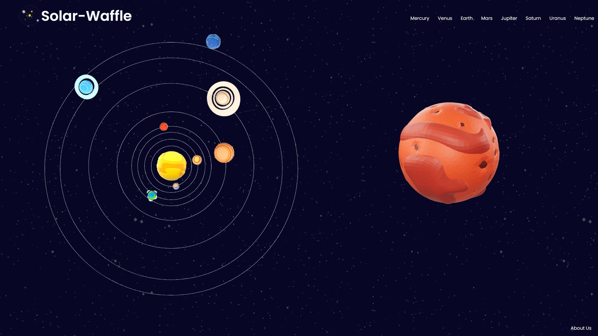
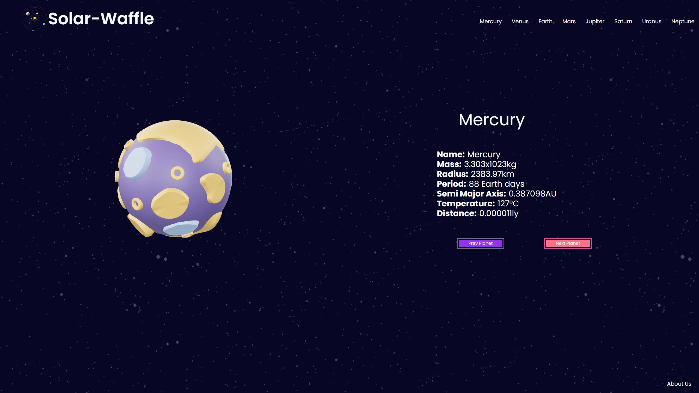
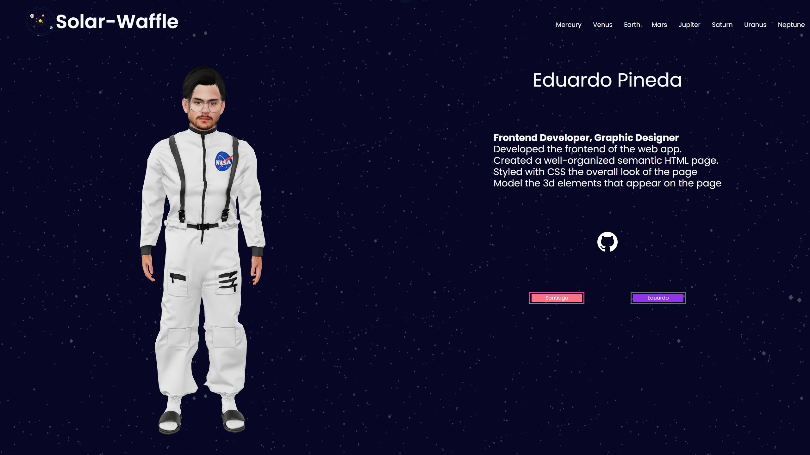
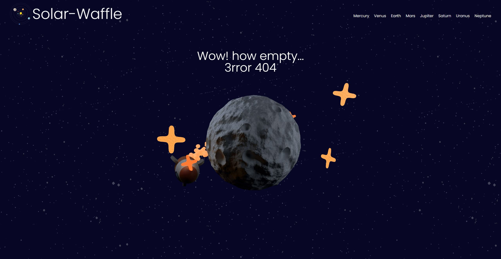

# solar-waffle
01 Project

# Description
This website allows users to navigate between the different planets of our solar system and view their information. The app offers user interaction and animation for the planets. On the main screen, the planet will rotate and change according to the last hovered element in the navigation bar. Once on the planet information screen, the 3D object of the planet will enable interaction with the user, allowing them to move it around with the mouse. Additionally, the website includes an About Us page, which displays each member of the team as a 3D image and provides our name, role, tasks within the project, and our Github link. 
# Project Requirements
- [x] https://github.com/santis1001/solar-waffle/issues/8
- [x] https://github.com/santis1001/solar-waffle/issues/9
- [x] https://github.com/santis1001/solar-waffle/issues/10
- [x] https://github.com/santis1001/solar-waffle/issues/11
- [x] https://github.com/santis1001/solar-waffle/issues/12
- [x] https://github.com/santis1001/solar-waffle/issues/13
- [x] https://github.com/santis1001/solar-waffle/issues/14
- [x] https://github.com/santis1001/solar-waffle/issues/15
- [ ] https://github.com/santis1001/solar-waffle/issues/16

# User Story
```
AS an astronomy enthusiast
I WANT to explore the solar system and learn about each planet's unique characteristics.
SO THAT I can deepen my understanding of our universe.
```
# Code Snippets
## HTML
### Header
The header element is constant between every page.
```html
<header>
    <div class="container relative min-w-full">
        <nav class="nav-planets flex items-center">
            <a class="flex items-center pl-20 pt-5" href="./">                    
                
                <h1 class="text-6xl text-slate-50 font-semibold pr-20">Solar-Waffle</h1>
            </a>
            <ul class="flex-1 text-right">
                <li class="list-none inline-block px-2 pt-10 z-10"><a class="text-xl text-slate-50 font-normal hover:font-medium px-2" id="Mercury" href="./planet.html?planet=Mercury">Mercury</a>
                </li>
                <li class="list-none inline-block px-2 z-10"><a class="text-xl text-slate-50 font-normal hover:font-medium px-2" id="Venus" href="./planet.html?planet=Venus">Venus</a>
                </li>
                <li class="list-none inline-block px-2 z-10"><a class="text-xl text-slate-50 font-normal hover:font-medium px-2" id="Earth" href="./planet.html?planet=Earth">Earth</a>
                </li>
                <li class="list-none inline-block px-2 z-10"><a class="text-xl text-slate-50 font-normal hover:font-medium px-2" id="Mars" href="./planet.html?planet=Mars">Mars</a>
                </li>
                <li class="list-none inline-block px-2 z-10"><a class="text-xl text-slate-50 font-normal hover:font-medium px-2" id="Jupiter" href="./planet.html?planet=Jupiter">Jupiter</a>
                </li>
                <li class="list-none inline-block px-2 z-10"><a class="text-xl text-slate-50 font-normal hover:font-medium px-2" id="Saturn" href="./planet.html?planet=Saturn">Saturn</a>
                </li>
                <li class="list-none inline-block px-2 z-10"><a class="text-xl text-slate-50 font-normal hover:font-medium px-2" id="Uranus" href="./planet.html?planet=Uranus">Uranus</a>
                </li>
                <li class="list-none inline-block px-2 z-10"><a class="text-xl text-slate-50 font-normal hover:font-medium px-2" id="Neptune" href="./planet.html?planet=Neptune">Neptune</a>
                </li>
            </ul>
        </nav>
    </div>
</header>
```
### Footer
The footer element is constant between Index and Planets page.
```html
<footer class="absolute bottom-0 right-0 m-5">
    <div>
        <a id="aboutus" class="text-xl text-slate-50 font-normal hover:font-medium px-2" href="./aboutus.html?prs=santiago">About Us</a>
    </div>
</footer>
```
### Index

```html
<main class="main">
    <div class="mt-10 z-0 flex flex-row-reverse h-full">
        
        <div id="modelcontent" class="modelcontent h-full w-3/6 grid justify-items-center flex items-center">
            <model-viewer id="model" src="./assets/models/mars/mars.gltf" orientation="0 0 0">
            </model-viewer> 
        </div>
    </div>
</main>
```
### Planet
```html
<main class="main">
    <div id="container" class="mt-10 z-0 flex flex-row h-full">
        <div class="modelcontent h-full w-3/6 grid justify-items-center flex items-center">                
            <model-viewer id="model" src="./assets/models/mars/mars.gltf" orientation="0 0 0"></model-viewer>             
        </div>
        <div id="infocont" class="h-full w-3/6 grid justify-items-center flex items-center">
            <div id="infocard" class=" text-slate-50 w-3/6">
                <h2 id="planet" class="text-6xl	p-20 w-fit	justify-self-center ">Earth</h2>
                <div class="info-planets text-3xl	">
                    <div class="flex flex-row"><p class="font-bold pr-2.5"> Name: </p><p id="name"></p></div>                    
                    <div class="flex flex-row"><p class="font-bold pr-2.5">Mass: </p><p id="mass"></p><p>x10<p id="superscript" class="sup"></p>kg</p></div>                    
                    <div class="flex flex-row"><p class="font-bold pr-2.5">Radius: </p><p id="radius"></p><p>km</p></div>      
                    <div class="flex flex-row"><p class="font-bold pr-2.5">Period: </p><p id="period"></p><p>&nbsp;Earth days</p></div>                                  
                    <div class="flex flex-row"><p class="font-bold pr-2.5">Semi Major Axis: </p><p id="semi_major_axis"></p><p>AU</p></div>                    
                    <div class="flex flex-row"><p class="font-bold pr-2.5">Temperature: </p><p id="temperature"></p><p>°C</p></div>                    
                    <div class="flex flex-row"><p class="font-bold pr-2.5">Distance: </p><p id="distance_light_year"></p><p>ly</p></div>                    
                </div>
                <div class="buttons p-20 flex justify-between">
                    <button id="prev" class="w-4/12 outline outline-offset-4 outline-pink-500 bg-rose-400">Prev Planet</button>
                    <button id="next" class="w-4/12 outline outline-offset-4 outline-pink-500 bg-rose-400">Next Planet</button>
                </div>
            </div>                
        </div>
    </div>
</main>    
```
### About Us
```html
<main id="ourmain">
    <div id="container" class="mt-10 z-0 flex flex-row h-full">
        <div id="modelcontent" class="modelcontent h-full w-3/6 grid justify-items-center flex items-center">                
            <model-viewer id="ourmodel" src="./assets/models/santiago.gltf" orientation="0 0 0"></model-viewer>             
        </div>
        <div id="credits" class="text-slate-50 h-2/3 w-3/6 grid justify-items-center flex items-center">
            <h2 id="Name" class="text-6xl	px-20 w-fit	justify-self-center">Earth</h2>
            <div id="info-credit" class="info-credit px-20 text-3xl">

            </div>                
            <div class="title-cont" >
                <a id="git" class="git" href="">
                    
                </a>
            </div>
            <div class="buttons px-20 w-3/6 flex justify-between">
                <button id="Santiago" class="w-4/12 outline outline-offset-4 outline-pink-500 bg-rose-400">Santiago</button>
                <button id="Eduardo" class="w-4/12 outline outline-offset-4 outline-pink-500 bg-rose-400">Eduardo</button>
            </div>
        </div>
        
    </div>
</main>
```
The About page will use the person object's description to populate the model with as much data as possible. 
```html
<div class="flex flex-row"><p class="font-bold">Content</p></div>                             
```
## CSS
The same Stylesheet is use through all pages.
### STyle
```css
@import url('https://fonts.googleapis.com/css2?family=Poppins:wght@300;400;500;600;700;800;900&display=swap');

:root{
    --dark-purple-color: #070724;
    --light-purple-color: #8854C0;
    --light-color: #fff;
    --dark-color: #000;
    --grey-color: #f2f2f2;
    --transition: all 300ms ease-in-out;
}
body {
    background-color: var(--dark-purple-color);
    overflow: hidden;
    background-image: url(./Stars.png);
}
main{
    height: 1000px;
}
* {
    font-family: Poppins;
}
.modelcontent model-viewer{
    height: 50%;
    width: 50%;
}
#ourmodel{
    height: 100%;
    width: 100%;
}
#ourmain{
    height: 1300px;
}
```

## Javascript
## Index script
* Document elements Variables
* Fetch the `planet.json` file and store it in a variable. This JSON contains an array of all the planets' names, 3D object location, and URL.
```js
var doc_model = document.getElementById('model');
var doc_container = document.getElementById('modelcontent');

var doc_planets=[];

var rotate;

var planets = fetch('./assets/planets.json')
.then(response => response.json())
.then(obj =>{
    planets = JSON.parse(JSON.stringify(obj));    
    main();
});
```
### `Main()` Function
* This function runs after the fetch of the planets is finished. It performs the following tasks:
* Runs a `forEach` loop that fills an array with the HTML `nav` elements.
* Runs a forEach loop that adds a mouseover event listener to every nav element.      
  * This event triggers the changeOBJ() function.
* Runs the `rotation()` function.
```js
function main(){

    planets.forEach(element => {
        doc_planets.push(document.getElementById(element.name));
    });
    doc_planets.forEach(element=>{
        element.addEventListener("mouseover",function(event){
            changeOBJ(event.target.textContent);
        });
    });
    
    rotation();
}
```
### `changeOBJ()` Function
* Gets the `textContent` of the nav element and compares it to the array to get its index.
* Stops the rotation interval.
* Clears the container that contains the 3D object of the planet.
* Creates a new HTML element for the object and fills its attributes with the necessary details for the selected planet.
* Restarts the `rotation()` function.
```js
function changeOBJ(e) {
    const index = planets.findIndex(obj  => obj.name == e)
    clearInterval(rotate);
    doc_container.innerHTML = '';
    doc_model = document.createElement('model-viewer');
    doc_model.setAttribute('id','model')
    doc_model.setAttribute('src',''+planets[index].obj);
    doc_model.setAttribute('orientation', '0 0 0');
    doc_container.appendChild(doc_model);
    rotation();
}
```
### `rotation()` Function
* This function performs the following tasks:
* Starts an interval of 16ms that will add 1 degree in every interval, which is set into the `<model-viewer orientation="0 0 0">` attribute.
```js
function rotation(){
    var deg = 1;
    rotate = setInterval(function () {
            doc_model.setAttribute('orientation', '0 0 '+deg+'deg');
            deg++;  
    }, 16);   
}
```
## Planets script
* Document elements Variables, and URL search parameters.
* Document element Object with references for each information elements.
* Fetch the `planet.json` file and store it in a variable. This JSON contains an array of all the planets' names, 3D object location, and URL.
```js
const queryString = window.location.search;
const urlParams = new URLSearchParams(queryString);

const planet = urlParams.get('planet'); 
var doc_title = document.getElementById('planet');
doc_title.textContent = planet;
var doc_container = document.getElementById('container');
var doc_model = document.getElementById('model');
var doc_info = document.getElementById('infocard');

var doc_previous = document.getElementById('prev');
var doc_information = {
    d_name : document.getElementById('name'),
    d_mass : document.getElementById('mass'),
    d_superscript : document.getElementById('superscript'),
    d_radius : document.getElementById('radius'),
    d_period : document.getElementById('period'),
    d_semi_major_axis : document.getElementById('semi_major_axis'),
    d_temperature : document.getElementById('temperature'),
    d_distance_light_year : document.getElementById('distance_light_year'),
};
var doc_next = document.getElementById('next');

var this_planet;

var planets = fetch('./assets/planets.json')
.then(response => response.json())
.then(obj =>{
    planets = JSON.parse(JSON.stringify(obj));    
    main();
});
```
### `main()` Function
This function runs after the fetch of the planets is finished. It performs the following tasks:
* Finds the index of the specified planet in the planets array.
* If the planet is within the array it will start to render element on screen for that planet 3D Object. 
* Runs the `rotation()` function
* If its not within the array the window will be redirected to a `error` page.
* At Last it set parametes to the button.
  * If the planet selected is the first planet the `previous` button option will be disable and the color will change. And the `next` button will be set to redirect to the next planet in the list.
  * If the planet selected isnt the first or last planet, both button will be set to redirect to the `previous` or `next` planet.
  * If the planet selected is the last planet the `next` button option will be disable and the color will change.And the `previous` button will be set to redirect to the next planet in the list.
```js
function main(){
    const index = planets.findIndex(obj  => obj .name === planet);

    if(index!=-1){
        this_planet = planets[index];

        doc_container.innerHTML = '';
        
        var doc_modelCont = document.createElement('div');
        doc_modelCont.setAttribute('class','modelcontent');

        doc_model = document.createElement('model-viewer');
        doc_model.setAttribute('id','model')
        doc_model.setAttribute('src',''+this_planet.obj);
        doc_model.setAttribute('orientation', '0 0 0');
        doc_model.setAttribute('camera-controls', '');
        doc_model.setAttribute('touch-action', 'pan-y');


        doc_modelCont.appendChild(doc_model);

        doc_container.appendChild(doc_modelCont);
        doc_container.appendChild(doc_info);

        rotation();

    }else{
        window.location.href = "./404.html";
    }
    
    if(index==0){
        doc_previous.setAttribute('class','w-4/12 outline outline-offset-4 outline-gray-500 bg-purple-600');
        doc_previous.setAttribute('disabled','')
        doc_next.addEventListener("click", function() {
            window.location.href = planets[index+1].url;
        });
    }
    if(index==planets.length-1){
        doc_previous.addEventListener("click", function() {
            window.location.href = planets[index-1].url;
        });
        doc_next.setAttribute('class','w-4/12 outline outline-offset-4 outline-gray-500 bg-purple-600');
        doc_next.setAttribute('disabled', '')
    }else{
        doc_previous.addEventListener("click", function() {
                window.location.href = planets[index-1].url;
            });
        
        doc_next.addEventListener("click", function() {
                window.location.href = planets[index+1].url;
            });
    }
}
```
### `getPlanetInfo()` Function
This function fetch additional information about the specified planet from an external API. It performs the following tasks:
* Set the variables necessary for the completion of the API fetch.
* Use the variables to fetch the details of the selected planet and store the raw information in a variable.
* If the fetch is successful it will run `formatInfo(rawinfo)` funtion and send the rawinfo as a parameter.
```js
getPlanetInfo();
var rawinfo;
var formatedinfo;
function getPlanetInfo(){
    const name = planet;
    const apikey = 'zbWNexeBqsRfaHKFij9NkA==9qt3zabp9IB1swYI';

    const apiUrl = 'https://api.api-ninjas.com/v1/planets?name='+name;
    const headers = {
        'X-Api-Key': apikey,
        'Content-Type': 'application/json'
    };

    var fet = fetch(apiUrl,{method:'GET',headers:headers}).then(function (response) {
        if (response.ok) {
        response.json().then(function (data) {
            rawinfo=data[0];
            formatInfo();
        });
        } else {

        }
    });
}

```
### `formatInfo()` Function
* function takes the raw information retrieved from the API and formats it for display on the webpage and stores it in a global object.
* Runs the `renderInfo()` Function.
```js
function formatInfo(){
    formatedinfo = {
        name: rawinfo.name,
        mass: massCalc(rawinfo.mass)[0],  
        superscript : massCalc(rawinfo.mass)[1], 
        radius: ((rawinfo.radius)*69911).toFixed(2),
        period: rawinfo.period,
        semi_major_axis: ''+rawinfo.semi_major_axis,
        temperature: (rawinfo.temperature-273),
        distance_light_year: rawinfo.distance_light_year,        
    };
    renderInfo();
}
```
### `renderInfo()` Function
* function updates the HTML elements on the webpage with the formatted planet information.
* It uses the doc_information and formatedinfo objects to get the reference and values to be displayed on the screen.
```js
function renderInfo(){
    doc_information.d_name.textContent = formatedinfo.name;
    doc_information.d_mass.textContent = formatedinfo.mass;
    doc_information.d_superscript.textContent = formatedinfo.superscript;
    doc_information.d_radius.textContent = formatedinfo.radius;
    doc_information.d_period.textContent = formatedinfo.period;
    doc_information.d_semi_major_axis.textContent = formatedinfo.semi_major_axis;
    doc_information.d_temperature.textContent = formatedinfo.temperature;
    doc_information.d_distance_light_year.textContent = formatedinfo.distance_light_year;
}
```
### `rotation()` Function
* This function performs the following tasks:
* Starts an interval of 16ms that will add 1 degree in every interval, which is set into the `<model-viewer orientation="0 0 0">` attribute.
```js
function rotation(){
    var deg = 1;
    rotate = setInterval(function () {
            doc_model.setAttribute('orientation', '0 0 '+deg+'deg');
            deg++;            
    }, 16);   
}
```
## About us script
* The code retrieves the query string parameters from the current URL using the `window.location.search` and `URLSearchParams` API and assigns it to the `queryString` and `urlParams` variables, respectively.
* It then retrieves some HTML elements from the current document using `getElementById` and assigns them to variables such as `doc_title`, `doc_modelCont`, `doc_info`, `doc_model`, `d_name`, `d_git`, `doc_sant`, and `doc_edu`.
* The code then fetches a JSON file containing information about some people using the `fetch` API and assigns it to the `info` variable.
```js
const queryString = window.location.search;
const urlParams = new URLSearchParams(queryString);

const this_name = urlParams.get('prs'); 
var doc_title = document.getElementById('myname');

var doc_modelCont = document.getElementById('modelcontent');
var doc_info = document.getElementById('info-credit');
var doc_model = document.getElementById('model');
var d_name = document.getElementById('Name');
var d_git = document.getElementById('git');

var doc_sant = document.getElementById('Santiago');
var doc_edu = document.getElementById('Eduardo');

var info = fetch('./assets/aboutus.json')
.then(response => response.json())
.then(obj =>{
    info = JSON.parse(JSON.stringify(obj));    
    //console.log(info);
    main();
});
```
### `main()` Function
* It then defines a `main` function that uses the retrieved information to populate the HTML elements.
* Within the `main` function, the code searches for the person with a matching `short` property in the retrieved JSON data using the `findIndex` method and assigns the corresponding object to the `thisinfo` variable.
* If a matching person is found, the code populates various HTML elements with information from the retrieved JSON object.
* If no matching person is found, the code redirects to a 404 error page using `window.location.href`.
* Lastly, the code updates the style and behavior of some HTML elements depending on the selected person using conditional statements.

```js
function main(){
    const index = info.findIndex(obj  => obj .short === this_name);
    var thisinfo;
    if(index!=-1){
        thisinfo = info[index];
        console.log(thisinfo);
        doc_title.textContent = ''+thisinfo.name;
        doc_modelCont.innerHTML = '';
        doc_modelCont.setAttribute('class','modelcontent h-full w-3/6 grid justify-items-center flex items-center');
        doc_model = document.createElement('model-viewer');
        doc_model.setAttribute('id','ourmodel')
        doc_model.setAttribute('src',''+thisinfo.obj);        
        doc_modelCont.appendChild(doc_model);
        d_name.textContent = ''+thisinfo.name;
        console.log(thisinfo.git);
        d_git.setAttribute('href',thisinfo.git);
        doc_info.innerHTML = '';        
        var createDiv = document.createElement('div');
        createDiv.setAttribute('class','flex flex-row');
        var roll = document.createElement('p');
        roll.setAttribute('class','font-bold');
        roll.textContent = thisinfo.roll;        
        createDiv.appendChild(roll);
        doc_info.appendChild(createDiv);
        var desc = thisinfo.description;
        console.log(thisinfo.description);
        for(var i=0;i<desc.length;i++){
            var createP = document.createElement('p');
            createP.setAttribute('class','flex flex-row');
            createP.textContent = desc[i];            
            doc_info.appendChild(createP);
        };
    }else{
        window.location.href = "./404.html";
    }
    
    if(index==0){
        doc_sant.setAttribute('class','w-4/12 outline outline-offset-4 outline-gray-500 bg-purple-600');
        doc_sant.setAttribute('disabled','')     
        doc_edu.addEventListener("click", function() {
            window.location.href = "./aboutus.html?prs=eduardo";
        });
    }
    if(index==1){
        doc_edu.setAttribute('class','w-4/12 outline outline-offset-4 outline-gray-500 bg-purple-600');
        doc_edu.setAttribute('disabled', '')
        doc_sant.addEventListener("click", function() {
            window.location.href = "./aboutus.html?prs=santiago";
        });
    }
}
```
# Screenshots




# Video

# Pages Link
Website Link [Github Pages Link](https://santis1001.github.io/solar-waffle/)
